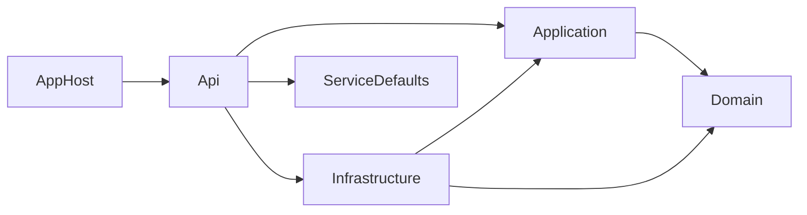
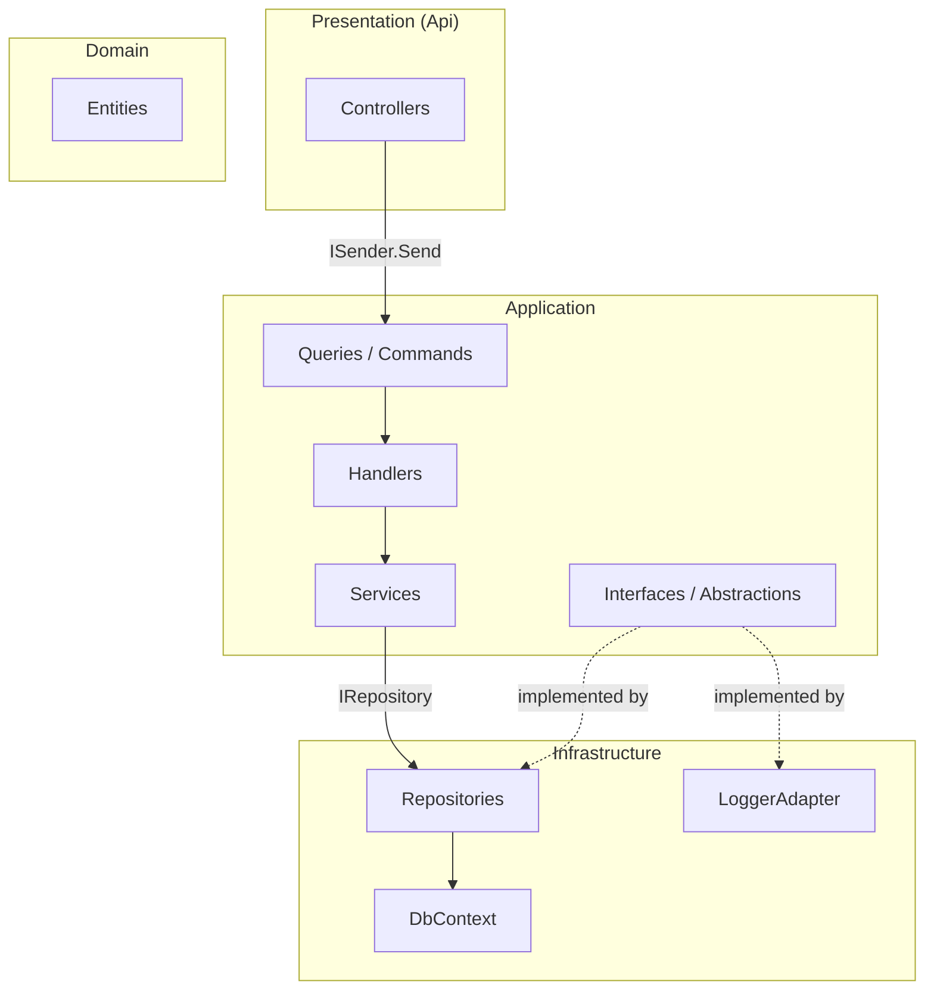
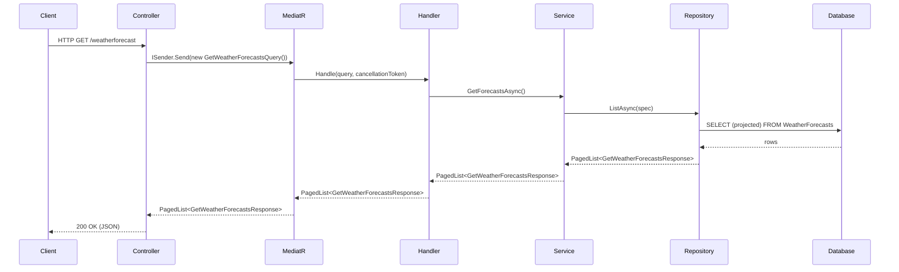
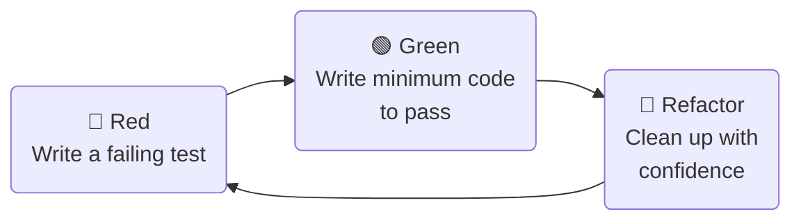

# A .NET Project Template

[](https://github.com/ovation22/Api.Project.Template/actions/workflows/ci.yml)

A production-ready template for building .NET Web API projects following Clean Architecture, CQRS, and test-driven development principles.

---

## Table of Contents

- [Prerequisites](#prerequisites)
- [Getting Started](#getting-started)
- [Running the Application](#running-the-application)
- [Database](#database)
- [Messaging](#messaging)
- [Solution Structure](#solution-structure)
- [Architecture](#architecture)
- [Patterns and Practices](#patterns-and-practices)
- [Testing Strategy](#testing-strategy)
- [API Design — Richardson Maturity Model](#api-design--richardson-maturity-model)
- [Roadmap](#roadmap)

---

## Prerequisites

Before running this template you will need:

- [.NET 10 SDK](https://dotnet.microsoft.com/download/dotnet/10.0)
- [Docker Desktop](https://www.docker.com/products/docker-desktop) (or Rancher Desktop) — required for .NET Aspire to spin up SQL Server
- .NET Aspire workload:
  ```powershell
  dotnet workload install aspire
  ```

> **Note:** The application is orchestrated via .NET Aspire. You should run the **AppHost** project, not the API project directly. Running the API project alone will fail because the SQL Server connection string is injected by Aspire at runtime.

---

## Getting Started

### Option 1 — Use as a Template (recommended)

**1. Clone this repository**

```powershell
git clone https://github.com/ovation22/Api.Project.Template.git
```

**2. Install the project template**

```powershell
dotnet new install ./Api.Project.Template
```

**3. Create a new project**

```powershell
dotnet new api-project -o Your.ProjectName
```

### Option 2 — Clone and rename

Clone the repo and do a solution-wide find-and-replace of `Api.Project.Template` with your project name.

---

## Running the Application

Always start the **AppHost** project. This starts Docker containers (SQL Server), injects connection strings, and wires up service discovery:

```powershell
dotnet run --project src/Api.Project.Template.AppHost
```

The .NET Aspire dashboard will open automatically and show you:
- Service URLs and health status
- Structured logs with correlation IDs
- Distributed traces
- Metrics

The API will be available at `https://localhost:7273` and interactive documentation at `/scalar`.

---

## Database

### First Run

On startup, `EnsureCreated()` in `Program.cs` creates the database schema and applies seed data automatically. No manual steps required.

### Seed Data

50 weather forecast records are seeded on first run (10 summary categories × 5 entries each) via `ModelBuilderExtensions.Seed()` in the Infrastructure project. The random number generator uses a fixed seed so data is deterministic across environments.

### Migrating to EF Migrations (recommended for production)

`EnsureCreated()` is intentionally used here for simplicity — it is not compatible with EF migrations and should be replaced before going to production. A commented migration path is left in `Program.cs`. When you are ready:

**1. Remove the `EnsureCreated()` block in `Program.cs`**

**2. Generate the initial migration:**

```powershell
dotnet ef migrations add InitialCreate \
  --project src/Api.Project.Template.Infrastructure \
  --startup-project src/Api.Project.Template.Api
```

**3. Replace `EnsureCreated()` with:**

```csharp
await db.Database.MigrateAsync();
```

From this point forward, schema changes are made by adding new migrations rather than modifying existing ones.

---

## Messaging

Messaging is provider-switchable via the `MessagingProvider` setting, following the same pattern as `DatabaseProvider`. Set it in `src/Api.Project.Template.AppHost/appsettings.json`:

| Value | Broker | Infrastructure |
|---|---|---|
| `None` | Disabled | No broker started or registered |
| `RabbitMq` | RabbitMQ | Docker container via Aspire, management UI at port 15672 |
| `ServiceBus` | Azure Service Bus | Azure Service Bus emulator via Aspire (no subscription required in dev) |
| `Sqs` | AWS SQS / SNS | LocalStack Docker container via Aspire (no AWS account required in dev) |

```json
{
  "MessagingProvider": "RabbitMq"
}
```

Changing this single value in AppHost `appsettings.json` switches the broker for all projects (API and Worker). The same setting is passed to each project as an environment variable by the Aspire orchestrator.

### Architecture

The message bus abstraction spans three layers:

- **Application** — `IMessagePublisher`, `IMessageProcessor<T>`, `MessageProcessingResult`, `MessageContext` — no broker details
- **Infrastructure** — `RabbitMqMessagePublisher`, `ServiceBusMessagePublisher`, `RoutingMessagePublisher` (decorator), broker adapters, `MessageConsumerWorker<TMessage, TProcessor>` — all broker details live here
- **Worker** — `WeatherRequestProcessor`, `Worker` — consumes messages; depends only on Application abstractions

### Publishing — Domain Events via MediatR

Messages are published from the Application layer using the **domain event pattern**:

1. A MediatR handler raises an `INotification` after completing its use case
2. An `INotificationHandler<T>` receives it and calls `IMessagePublisher.PublishAsync`
3. `RoutingMessagePublisher` resolves the destination from `MessageBus:Routing:Routes` config and delegates to the active broker publisher

```
Handler → IPublisher.Publish(WeatherForecastRequestedEvent)
        → WeatherForecastRequestedEventHandler
        → IMessagePublisher.PublishAsync
        → RoutingMessagePublisher → RabbitMqMessagePublisher / ServiceBusMessagePublisher / SqsMessagePublisher
```

### Routing Configuration

Routes are configured per message type in `appsettings.json`. The key is `typeof(T).Name` of the published event. `RoutingKey` (RabbitMQ), `Subject` (Service Bus / SNS), and `Destination` (queue URL or SNS topic ARN for SQS) coexist so you can switch providers without changing routing config:

```json
"MessageBus": {
  "Routing": {
    "Provider": "Auto",
    "DefaultDestination": "weather-requests",
    "Routes": {
      "WeatherForecastRequestedEvent": {
        "Destination": "weather-requests",
        "RoutingKey": "WeatherRequested",
        "Subject": "WeatherRequested"
      }
    }
  },
  "Sqs": {
    "Region": "us-east-1",
    "DefaultDestination": ""
  }
}
```

For SQS/SNS, `Destination` in a route is either a queue URL (`https://sqs.us-east-1.amazonaws.com/…/queue-name`) or an SNS topic ARN (`arn:aws:sns:us-east-1:…:topic-name`). The publisher detects the type automatically by the ARN prefix. For local development with LocalStack the URLs follow the pattern `http://localhost:4566/000000000000/queue-name`.

### Consuming — Worker Service

`Api.Project.Template.Worker` is a .NET Worker Service that runs alongside the API. Each consumer is registered with `AddMessageConsumer<TMessage, TProcessor, TWorker>()`:

- **`WeatherRequested`** — message shape, must match the serialized form of the published event
- **`WeatherRequestProcessor`** — implements `IMessageProcessor<WeatherRequested>`, returns `MessageProcessingResult.Succeeded()` / `Failed(reason, requeue)` to control ACK/NACK/dead-letter behavior
- **`Worker`** — named `BackgroundService` subclass of `MessageConsumerWorker<TMessage, TProcessor>`

Consumer queue and broker-specific settings live in the Worker's `appsettings.json`:

```json
"MessageBus": {
  "Consumer": {
    "Queue": "weather-requests",
    "Concurrency": 5,
    "MaxRetries": 3,
    "PrefetchCount": 10
  },
  "RabbitMq": {
    "Exchange": "apiprojecttemplate.events",
    "RoutingKey": "WeatherRequested",
    "ExchangeType": "topic"
  },
  "Sqs": {
    "Region": "us-east-1"
  }
}
```

`MessageBus:Consumer:Queue` is the queue name for RabbitMQ and Service Bus, and the SQS queue name for AWS (the adapter resolves it to a full URL via `GetQueueUrlAsync` at startup). For SQS, dead-lettering is handled by configuring a **DLQ redrive policy** on the queue itself rather than in code — messages that exceed `MaxRetries` are deleted and fall through to the DLQ if one is attached.

---

## Solution Structure

```
src/
├── Api.Project.Template.Api            # Entry point — controllers, middleware, config
├── Api.Project.Template.Application    # Business logic — CQRS, services, abstractions
├── Api.Project.Template.Domain         # Core — entities, domain rules, value objects
├── Api.Project.Template.Infrastructure # Data access, messaging — EF Core, repositories, broker adapters
├── Api.Project.Template.Worker         # Background worker — message consumers
├── Api.Project.Template.AppHost        # .NET Aspire orchestrator
└── Api.Project.Template.ServiceDefaults # Shared Aspire configuration

tests/
├── Api.Project.Template.Tests.Unit         # Unit tests — xUnit v3, Moq, FluentAssertions
├── Api.Project.Template.Tests.Integration  # Integration tests — xUnit v3, SQLite, WebApplicationFactory
├── Api.Project.Template.Tests.Architecture # Architectural rule enforcement — NetArchTest
└── Api.Project.Template.Tests.Benchmark    # Performance benchmarks — BenchmarkDotNet
```

### Dependency Flow



Domain has no dependencies on any other project — it is pure. Application owns the use-case contracts (`IRepository`, `ILoggerAdapter<T>`), so Infrastructure points to Application, not Domain. Infrastructure is never referenced by the Api for business logic — only for DI registration in `Program.cs`.

---

## Architecture

This template follows **Clean Architecture** (also known as Onion Architecture or Hexagonal Architecture). The key rule is the **Dependency Inversion Principle** — high-level policy (Domain, Application) must not depend on low-level details (Infrastructure, frameworks).



### Domain Project

The center of the architecture. Has no external dependencies beyond `System` and data annotation attributes. Domain should be pure — entities, value objects, domain events, and domain rules only. No persistence concepts belong here. Contains:

- **Entities** — objects with identity (e.g. `WeatherForecast`)
- **Value Objects** — immutable objects defined by their attributes (add as needed)
- **Domain Events** — signals that something meaningful happened (add as needed)

### Application Project

Orchestrates use cases. Depends on Domain only. Owns the contracts (interfaces) that use cases need fulfilled — keeping Infrastructure pointing inward toward Application, not Domain. Contains:

- **Queries and Commands** — MediatR `IRequest<T>` records
- **Handlers** — implement `IRequestHandler<TRequest, TResponse>`, call services, map to responses
- **Services** — `IWeatherForecastService` — the handler's single dependency, keeps handlers thin
- **Response records** — paired with their query (e.g. `GetWeatherForecastsResponse`)
- **Abstractions** — `IRepository` and `ILoggerAdapter<T>` — defined here, implemented in Infrastructure

### Infrastructure Project

Implements the interfaces defined in Domain and Application. Can reference EF Core, SQL Server drivers, HTTP clients, etc. Contains:

- **`ProjectTemplateContext`** — EF Core DbContext
- **Entity configurations** — `IEntityTypeConfiguration<T>` classes in `Data/Configurations/`
- **Seed data** — `ModelBuilderExtensions.Seed()` in `Data/Extensions/`
- **Repository** — `ContextRepository` implements `IRepository` via `EFRepository`
- **`LoggerAdapter<T>`** — implements `ILoggerAdapter<T>` using `ILogger<T>`

### Api Project

The outermost layer. Depends on Application and Infrastructure (for DI registration only). Contains:

- **Controllers** — thin, no business logic, call `ISender.Send()` and return the result
- **`Program.cs`** — service registration, middleware pipeline
- **Config** — health check configuration

---

## Patterns and Practices

### CQRS with MediatR

**Command Query Responsibility Segregation** separates read operations (queries) from write operations (commands). MediatR provides the in-process messaging bus.

**Folder convention:**
```
Application/Features/{Feature}/
├── Queries/
│   ├── Get{Feature}Query.cs
│   ├── Get{Feature}Response.cs
│   └── Handlers/
│       └── Get{Feature}QueryHandler.cs
├── Commands/
│   ├── Create{Feature}Command.cs
│   └── Handlers/
│       └── Create{Feature}CommandHandler.cs
└── Services/
    ├── I{Feature}Service.cs
    └── {Feature}Service.cs
```

**Request pipeline:**



**Why a service between the handler and the repository?**

The handler's job is to orchestrate — receive a request, call a service, map to a response. If the handler calls the repository directly it becomes harder to test and harder to swap implementations. The service is the seam. When the data access logic grows complex (filtering, pagination, caching), it lives in the service, not the handler.

### Repository Pattern

`IRepository` is defined in Application. `EFRepository` (abstract) and `ContextRepository` (concrete) live in Infrastructure. Application code depends on `IRepository`, never on EF Core directly. This keeps business logic testable without a database.

### Generic Repository vs Specific Repositories

This template ships with a generic `IRepository`. As your domain grows, consider adding specific repository interfaces (e.g. `IWeatherForecastRepository : IRepository`) that expose only the operations that feature needs. This follows the **Interface Segregation Principle** and prevents handlers from having access to operations they shouldn't use.

### Logger Adapter

`ILoggerAdapter<T>` wraps `ILogger<T>` and is defined in Application. This allows handlers and services to log without taking a hard dependency on `Microsoft.Extensions.Logging`, keeping Application infrastructure-free and making logging easy to mock in tests.

### Result Pattern

Handlers return `Result<T>` (from `Ardalis.Result`) instead of throwing exceptions for expected failure cases. This makes the handler's contract explicit — callers know a failure is possible without relying on exception handling for control flow.

| Result type | HTTP mapping (via `ToActionResult`) |
|---|---|
| `Result.Success(value)` | `200 OK` |
| `Result.NotFound()` | `404 Not Found` |
| `Result.Invalid(errors)` | `400 Bad Request` |
| `Result.Forbidden()` | `403 Forbidden` |
| `Result.Error(message)` | `500 Internal Server Error` |

Controllers call `this.ToActionResult(result)` (from `Ardalis.Result.AspNetCore`) which maps the result status to the correct HTTP response automatically — no manual `if/switch` on status codes needed.

```csharp
// Handler
public async Task<Result<PagedList<GetWeatherForecastsResponse>>> Handle(...)
{
    var forecasts = await repository.ListAsync(spec, cancellationToken);
    return Result.Success(forecasts);
}

// Controller
public async Task<ActionResult<PagedList<GetWeatherForecastsResponse>>> Filter(...)
{
    var result = await sender.Send(new GetWeatherForecastsQuery(request), cancellationToken);
    return this.ToActionResult(result);
}
```

Unhandled exceptions (infrastructure failures, unexpected errors) still propagate to `ExceptionHandlingMiddleware`, which returns a `500 ProblemDetails` response. The Result pattern handles *expected* failures; the middleware handles *unexpected* ones.

### Dependency Injection

Services are registered in extension methods:

- `builder.Services.AddApplication()` — MediatR, application services
- `builder.Services.AddInfrastructure()` — repository, logger adapter
- `builder.AddSqlServerDbContext<ProjectTemplateContext>("ProjectTemplate")` — EF Core via Aspire

---

## Testing Strategy

This template is structured to support **Test-Driven Development (TDD)**. The recommended cycle is:



1. **Red** — write a failing test that describes the behavior you want
2. **Green** — write the minimum code to make it pass
3. **Refactor** — clean up with confidence, tests protect you

### Unit Tests (`Tests.Unit`)

Test individual classes in isolation. Dependencies are replaced with mocks (Moq). No database, no HTTP, no I/O.

**What to unit test:**
- Handlers — verify mapping, verify service is called exactly once
- Services — verify repository is called, verify result passes through
- Domain logic — any computed properties or rules on entities

**What not to unit test:**
- Controllers — they're one line; integration tests cover them
- Infrastructure — EF Core is not your code; integration tests cover it

**Naming convention:** `Method_WhenCondition_ExpectedResult`

**Structure:** mirrors `Application/Features/` exactly so tests are easy to find.

```
Tests.Unit/
└── Features/
    └── Weather/
        ├── Queries/
        │   └── GetWeatherForecastsQueryHandlerTests.cs
        └── Services/
            └── WeatherForecastServiceTests.cs
```

### Integration Tests (`Tests.Integration`)

Test the full request pipeline — controller → MediatR → handler → service → repository → database — using `CustomWebApplicationFactory` and SQLite as a fast in-process substitute for SQL Server.

**Key design decisions:**
- `CustomWebApplicationFactory` removes Aspire's SQL Server DbContext pool and replaces it with a plain SQLite DbContext
- A single `SqliteConnection` is held open for the fixture's lifetime — in-memory SQLite databases are destroyed when all connections close
- `EnsureCreated()` is called once in the test constructor to apply schema and seed data

**Structure:** mirrors the API route structure

```
Tests.Integration/
├── CustomWebApplicationFactory.cs
└── Weather/
    └── WeatherForecastTests.cs
```

### Architecture Tests (`Tests.Architecture`)

Enforce structural rules using NetArchTest. These tests ensure the architecture does not rot over time:

- Controllers do not reference Domain entities directly
- Controllers do not reference Infrastructure
- Interfaces start with `I`

Add rules here as your architecture decisions solidify. These tests are cheap and catch violations early.

### Benchmark Tests (`Tests.Benchmark`)

Performance benchmarks using BenchmarkDotNet. Run in Release mode only:

```powershell
dotnet run --project tests/Api.Project.Template.Tests.Benchmark -c Release
```

---

## API Design — Richardson Maturity Model

The [Richardson Maturity Model](https://martinfowler.com/articles/richardsonMaturityModel.html) describes four levels of REST API maturity:

| Level | Description |
|-------|-------------|
| **0** | Single URI, single HTTP method (RPC over HTTP) |
| **1** | Multiple URIs representing resources |
| **2** | HTTP verbs used correctly (GET, POST, PUT, DELETE) + status codes |
| **3** | Hypermedia controls (HATEOAS) |

**This template targets Level 2**, which is the practical standard for most production APIs:

- Resources are nouns (`/weatherforecast`, not `/getWeatherForecast`)
- HTTP verbs convey intent (`GET` retrieves, `POST` creates, `PUT` replaces, `DELETE` removes)
- Status codes are meaningful (`200 OK`, `201 Created`, `404 Not Found`, `400 Bad Request`)
- URLs are lowercase (configured via `RouteOptions.LowercaseUrls`)

**Recommendations when building on this template:**

- Keep controllers thin — one line per action, delegate everything to MediatR
- Return `IActionResult` or `Results<T>` rather than raw types so you can control status codes
- Use `ProblemDetails` for errors (already configured) — it provides a consistent error shape
- Version your API from day one (e.g. `/v1/weatherforecast`) — retrofitting versioning is painful
- Never expose your domain entities or EF models directly — always map to a response record

---

## Roadmap

### Included

- [x] .NET 10 Web API
- [x] .NET Aspire (AppHost & ServiceDefaults)
- [x] Clean Architecture layering
- [x] CQRS with MediatR
- [x] Generic Repository pattern
- [x] Entity Framework Core
  - [x] with SQL Server
  - [x] with PostgreSQL
- [x] Messaging (provider-switchable via `MessagingProvider`)
  - [x] RabbitMQ
  - [x] Azure Service Bus
  - [x] AWS SQS / SNS (LocalStack for local dev — no AWS account required)
  - [x] Domain event pattern (MediatR notifications → message bus)
  - [x] Worker Service consumer (`Api.Project.Template.Worker`)
- [x] Specifications (Ardalis.Specification)
- [x] Result pattern (Ardalis.Result)
- [x] Seed data
- [x] Structured logging with Serilog
- [x] Global exception handling middleware
- [x] Health checks
- [x] OpenTelemetry (distributed tracing & metrics)
- [x] Service discovery
- [x] Unit tests — xUnit v3, Moq, FluentAssertions
- [x] Integration tests — xUnit v3, SQLite, CustomWebApplicationFactory
- [x] Architecture tests — NetArchTest
- [x] Benchmark tests — BenchmarkDotNet

### Planned

- [ ] Guard clauses
- [ ] HTTP client (typed, with resilience)
